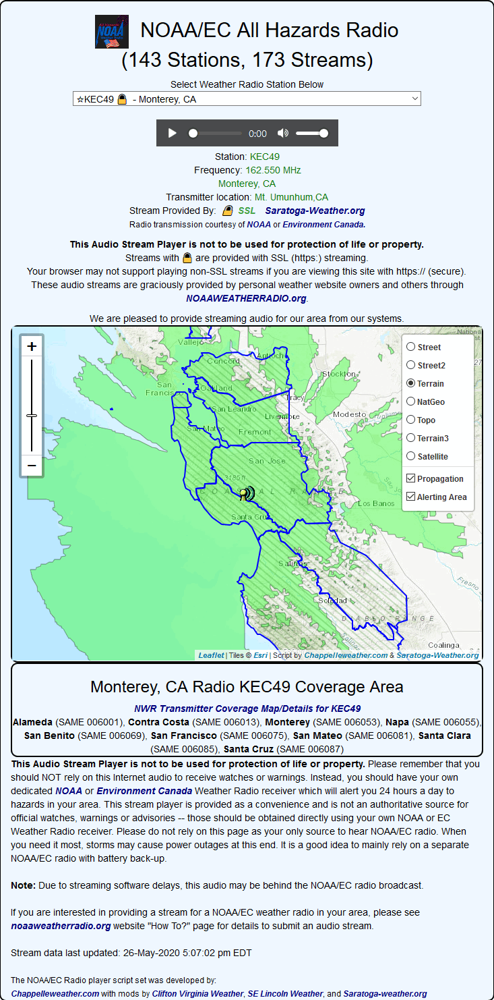

# NOAA/EC All Hazards Radio stream player

Both [NOAA/NWS](https://www.weather.gov/nwr/) and [Environment Canada](https://www.ec.gc.ca/meteo-weather/default.asp?lang=En&n=792F2D20-1) operate many radio transmitters that carry NWS/EC weather and alert information. For many years, the WeatherUnderground website offered a place for weather enthusiasts to stream their local weather radio audio and for others to listen to the streaming audio on their systems. In January, 2017, WeatherUnderground stopped supporting that service, so a small band of enthusiastic volunteers created a new home for those streams at [**https://noaaweatherradio.org/**](https://noaaweatherradio.org/) as a non-commercial public service. You can follow the story of the creation of noaaweatherradio.org at WXforum.net [here](https://www.wxforum.net/index.php?topic=30900.0) and [here](https://www.wxforum.net/index.php?topic=31396.0). My particular thanks go to Mike at [Frankfort/Twin Hollies Weather](https://frankfortweather.us/) for his continuing work to host, create, and populate the streams for noaaweatherradio.org and to Chris of [CrushedBox Software](https://crushedboxsoftware.com/) for hosting the stream server.

If **you** are interested in providing a stream of a NOAA/EC weather radio in your area, please see [noaaweatherradio.org](https://noaaweatherradio.org/) website "How To?" page for details to submit an audio stream.

The _radios.php_ script (and the _wxradio.php_ script for the Saratoga template) use the noaaweatherradio.org website data to show a page with the currently available radio streams, and allow the browser's audio player to play them. The scripts use HTML5/JavaScript/CSS with PHP to provide the small amount of customization required. The screen formatting uses jQuery and Bootstrap which is dynamically included in the page.

The original HTML5/JavaScript player page was created by Doug at [Chappellweather.com](https://chappelleweather.com/). Mods were made to that script by Bob at [Clifton Virginia Weather](https://cliftonvaweather.com/), Jerry at [SE Lincoln Weather](https://www.gwwilkins.org/) and John at [Echo Valley Weather](https://salineweather.com/). The modifications to use [noaaweatherradio.org](https://noaaweatherradio.org/) data to generate the page/map and the packaging was done by [Saratoga-weather.org](https://saratoga-weather.org/).

The script uses a JavaScript/JSON file maintained on [noaaweatherradio.org](https://noaaweatherradio.org/). To minimize the loading on that site, the _NWR-radio-data.php_ program will fetch and cache locally the needed file and refresh it every hour as need be. The required images are included in the distribution .zip files.

Version 2.00 of the script now uses Leaflet/OpenStreetMaps to generate the location map for the transmitter. You no longer need a Google API key as the map does not use Google Maps for display. If you have a Mapbox.com Access Token, you can display two additional Mapbox maps, but that is optional. Five open (no key) maps are available with the Version 2.00 script.  
Major thanks are given to Doug Chappelle for his initial conversion of the V1.x script to Leaflet -- I've just put some finishing touches and packaging on his work. Note also that the Standalone and Template versions are now combined into one distribution with common support code.

Version 3.00 of the script leverages data at the new [NWR Site](https://www.weather.gov/nwr/) and adds shapefile displays of
transmitter propagation and county/SAME codes covered for all NWS sites.  The default option is not-displayed for these two overlays,
but a simple click on the checkbox in the map menu will enable the display of the overlay(s).
Note that this feature is not available for EC radios or for static streams that may appear on noaaweatherradio.org site.
## Sample output



## Configuration

```php
############################################################################
# wxradio settings
# note: you can also use the following in Settings.php to override the below settings:
/*

$SITE['WXRstartup'] = 'KEC49';   // override $startup in wxradio.php
$SITE['WXRprovider'] = true;     // override $streamprovider in wxradio.php
$SITE['WXRmapprovider'] = 'Esri_WorldTopoMap'; // override $mapProvider in wxradio.php
$SITE['WXRautoplay'] = true;     // override $autoplaystartup in wxradio.php
$SITE['WXRbackground'] = 'lightcyan'; // override $backgroundColor in wxradio.php
// see https://www.w3schools.com/cssref/css_colors.asp for color names
// Optional:
$SITE['mapboxAPIkey'] = '--mapbox-API-key--';  // use this for the API key to MapBox

*/
############################################################################
#
$startup = 'KEC49'; // Radio for first display, if 'alternate' include the -[char] in the name
//                     like 'KEC49-A'.  That value is displayed on the page after Station:
//                     when the station is selected in the dropdown list.
// Note that specific stream calls for alternate streams may change so it's best to use a
//   different search (such as the below) to select a specific stream for initial display.
//
//You can also use the City, provider name or website name to match.
// $startup = 'Monterey Marine';
// $startup = 'saratoga-weather.org';
// $startup = 'mikev';
$streamprovider = false; // =true if you provide a stream, =false if you don't provide a stream
//
$autoplaystartup = true; // =true; start audio when page loads, =false; no autoplay on page load
#
$backgroundColor = 'lightcyan'; // CSS color name or #rrggbb hex format style for overall player
# see https://www.w3schools.com/cssref/css_colors.asp for color names and hex codes
$mapProvider = 'Esri_WorldTopoMap'; // ESRI topo map - no key needed
//$mapProvider = 'OSM';     // OpenStreetMap - no key needed
//$mapProvider = 'Terrain'; // Terrain map by stamen.com - no key needed
//$mapProvider = 'OpenTopo'; // OpenTopoMap.com - no key needed
//mapProvider = 'Wikimedia'; // Wikimedia map - no key needed
//
//$mapProvider = 'MapboxSat';  // Maps by Mapbox.com - API KEY needed in $mapboxAPIkey
//$mapProvider = 'MapboxTer';  // Maps by Mapbox.com - API KEY needed in $mapboxAPIkey

$mapboxAPIkey = '--mapbox-API-key--';  // use this for the Access Token (API key) to MapBox
```

For [Saratoga template users](https://saratoga-weather.org/wxtemplates/index.php), you normally do not have to customize the _wxradio.php_ script itself as the most common configurable settings are maintained in your _Settings.php_ file. This allows you to just replace the files on your site when new versions are released.

<dl>

<dt>**$SITE['WXRstartup'] = 'KEC49';**</dt>

<dd>This setting controls the $startup search string to find the selected radio stream when the page first loads.  
It can be the radio callsign or if it is an 'alternate' stream, include the -[char] in the name like 'KEC49-A'. That value is displayed on the page after **Station:** when the station is selected in the dropdown list.  
Note that specific stream calls for alternate streams may change so it's best to use a different search (such as the below) to select a specific stream for initial display. You can also use the City, provider name or website name to match. like  
'Monterey Marine', 'saratoga-weather.org', or 'mikev'  
</dd>

<dt>**$SITE['WXRprovider'] = true;**</dt>

<dd>This setting adds text to the page regarding your site providing one or more streams:  
**=true;** - your site provides one or more NWR/EC streams  
**=false;** - your site does not provide any NWR/EC radio streams.</dd>

<dt>**$SITE['WXRmapboxProvider'] = 'Esri_WorldTopoMap';**</dt>

<dd>This specifies the default map tile provider to be used. The default is:  
**= 'Esri_WorldTopoMap';** ESRI topo map - no key needed (Default)  
**= 'OSM'; OpenStreetMap** - no key needed  
**= 'Terrain';** Terrain map by stamen.com - no key needed  
**= 'OpenTopo';** OpenTopoMap.com - no key needed  
**= 'Wikimedia';** Wikimedia map - no key needed  
**= 'MapboxSat';** Satellite Maps by Mapbox.com - Mapbox API KEY needed  
**= 'MapboxTer';** Terrain Maps by Mapbox.com - Mapbox API KEY needed</dd>

<dt>**$SITE['WXRautoplay'] = true;**</dt>

<dd>This setting controls the behavior of the player when the page is first loaded.  
**=true;** - start playing the audio from the selected stream when the page loads  
**=false;** - play the audio after manual click on 'play' button in player when the page first loads</dd>

<dt>**$SITE['WXRbackground'] = 'lightcyan';**</dt>

<dd>This setting sets the CSS background color of the player content page. You can use either a CSS color name or a _#rrggbb_ hex CSS color for the value. See the list of available CSS color names at [w3schools](https://www.w3schools.com/cssref/css_colors.asp).</dd>

<dt>**$SITE['mapboxAPIkey'] = '--mapbox-API-key--';**</dt>

<dd>

If you wish to use the **OPTIONAL** Mapbox.com tiles (terrain3, Satellite maps), you will need a Mapbox.com API key (called an "Access Token") which can be acquired (for free with 50K accesses usage/month) at:

**[https://www.mapbox.com/signup/?](https://www.mapbox.com/signup/?)**  

This setting is also used by other scripts: wxquake.php (quake-json.php), wxmesonetmap.php (mesonet-map.php) and wxglobal.php (global-map.php).
</dd>
</dl>
